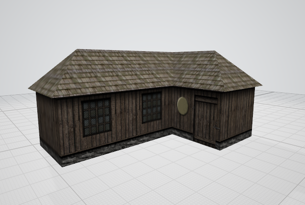

# Hidden & Dangerous I3D Tools

This repository provides utilities for working with **Illusion Softworks I3D model files** (as used in *Hidden & Dangerous* and *Hidden & Dangerous: Deluxe*).  

The I3D format is derived from the **Autodesk 3D Studio `.3ds` format**, but extends it with additional chunk types (e.g. `0x4200 FACE_MAP_CHANNEL` for multi-UV support).

---

## Roadmap

### Phase 1
- ✅ I3D Chunk analysis - **Successful with multiple i3d files**
- ✅ Decoding of `0x4200 FACE_MAP_CHANNEL` - **Fully understood and documented**
- ✅ Fetch textmaps: **Successful with door.i3d**
- ✅ Proof-of-concept: I3D → OBJ - **Successful with domek.i3d**
- ✅ Roundtrip: I3D → OBJ → I3D - **Successful with door.i3d**
- ❌ Ingame testing of theoretical success

### Phase 2
- ❌ Convert I3D to 3DS
- ❌ Convert 3DS to I3D
- ❌ Animation/keyframe decoding

### Phase 3
- ❌ Blender .i3d importer that respects I3D-specific chunks  
- ❌ Blender .i3d exporter

---

## Tools

### 1. I3D / 3DS Analyzer

📄 [Documentation](documentation/i3d_analyzer.md)  
⚙️ [Download Script](tools/i3d_analyzer.py)

A registry-driven parser that inspects the full binary chunk structure of `.i3d` files.  

**Usage:**
```bash
python i3d_analyzer.py file.i3d
```

---

### 2. I3D → OBJ Converter

📄 [Documentation](documentation/i3d_to_obj.md)  
⚙️ [Download Script](tools/i3d_to_obj.py)

Converts `.i3d` models into **Wavefront OBJ + MTL** files for use in Blender, MeshLab, Microsoft 3D Viewer, etc.  

**Usage:**
```bash
# Basic conversion
python i3d_to_obj.py domek.i3d

# With custom axis mapping
python i3d_to_obj.py domek.i3d --transform "(x, -z, y)"

# Bake object transforms into vertices
python i3d_to_obj.py domek.i3d --bake
```


---

### 3. I3D Texture Map Collector

📄 [Documentation](documentation/i3d_texture_map_collector.md)  
⚙️ [Download Script](tools/i3d_texture_map_collector.py)

Scans an I3D file for texture references and copies the found images into the **same folder as the script**, ready for use in downstream tools.  

**Usage:**
```bash
python i3d_texture_map_collector.py domek.i3d
```

On first run, generates a config file (`i3d_textures.config.json`) with `search_paths` you can edit to point to your texture directories.

---

### 4. OBJ → I3D Converter

📄 [Documentation](documentation/obj_to_i3d.md)  
⚙️ [Download Script](tools/obj_to_i3d.py)

Converts **Wavefront OBJ + MTL** files back into the **I3D format**. Supports materials, UV mapping, smoothing groups, and optional keyframer data.  

**Usage:**
```bash
# Basic conversion
python obj_to_i3d.py cube.obj

# Custom object name
python obj_to_i3d.py cube.obj --name "MyObject"

# With keyframer block
python obj_to_i3d.py cube.obj --kf

# Without V-flip (preserve OBJ's native V orientation)
python obj_to_i3d.py cube.obj --no-flip-v
```

---

## License

MIT License — free to use, modify, and share.
